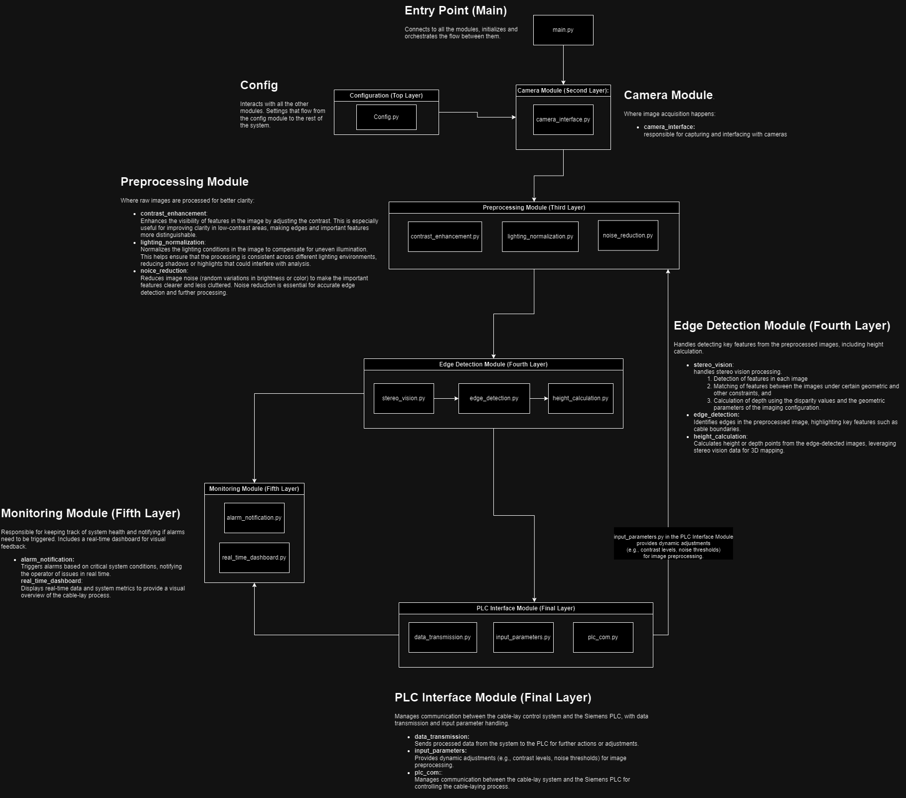

## **Prototype Cable-Lay System**

This project is a **machine vision-based semi-automatic compensation system** designed for cable-lay vessels. It integrates stereo vision and image processing techniques to detect and monitor the cable curve, compensating for light conditions and interfacing with a Siemens PLC for controlling the cable-laying process.

### **Table of Contents**
- [Overview](#overview)
- [Project Structure](#project-structure)
- [Installation](#installation)
- [Usage](#usage)
- [Modules](#modules)
- [Module Diagram](#module-diagram)
- [Testing](#testing)
- [Contributing](#contributing)
  
### **Overview**
The system captures images using stereo vision, processes these images to enhance their quality, and then performs edge detection and height calculation on the cable to monitor and regulate the laying process. The processed data is transmitted to a PLC, which adjusts the laying speed in real-time.

### **Project Structure**

The project is organized into several modules, each responsible for a specific functionality:

```plaintext
Prototype_CableLaySys/
├── config/                 # Configuration settings for the entire system
│   └── config.py
├── modules/
│   ├── camera/             # Handles camera interface
│   ├── edge_detection/     # Handles stereo vision, edge detection and height calculation
│   ├── monitoring/         # Real-time monitoring and alarm notification
│   ├── plc_interface/      # Communication with PLC and dynamic parameter handling
│   └── preprocessing/      # Image preprocessing (contrast, noise reduction, etc.)
├── tests/                  # Unit tests for individual modules
├── utils/                  # Utility scripts (logging, image utilities)
├── main.py                 # Main entry point for running the system
├── README.md               # Project documentation
└── requirements.txt        # Python dependencies
```

### **Installation**

To get started with this project, follow these steps:

#Create a virtual environment
python3 -m venv --system-site-packages new_env

#Activate the new environment
source new_env/bin/activate

#Update pip
pip install --upgrade pip

#Install mediapipe
pip install mediapipe

1. **Clone the repository**:
   ```bash
   git clone https://github.com/Nikosepose/CableLaySys
   cd Prototype_CableLaySys
2. **Install the dependencies**:
    ```bash
   pip install -r requirements.txt
   
### **Installation**
Dont know yet

### **Modules**
Each module has a specific responsibility within the system:

- Camera Module (camera/):
  - camera_interface.py: Handles image capture from stereo cameras.

- Preprocessing Module (preprocessing/):
  - contrast_enhancement.py: Adjusts the contrast of the images.
  - noise_reduction.py: Reduces noise from the images.
  - lighting_normalization.py: Normalizes lighting conditions across the image. 

- Edge Detection Module (edge_detection/):
  - stereo_vision.py: Processes captured images to generate a depth map.
  - edge_detection.py: Detects edges in the processed images (like cable boundaries).
  - height_calculation.py: Calculates the height points from the detected edges using stereo vision depth data.

- Monitoring Module (monitoring/):
  - alarm_notification.py: Sends notifications if critical thresholds are reached.
  - real_time_dashboard.py: Displays real-time system data for monitoring.

- PLC Interface Module (plc_interface/):
  - data_transmission.py: Sends the processed data to the PLC.
  - input_parameters.py: Retrieves and manages parameters from the PLC.

- Utilities (utils/):
  - image_utils.py: Image processing helper functions.
  - logging.py: Sets up logging for the system.


### **Module Diagram**

